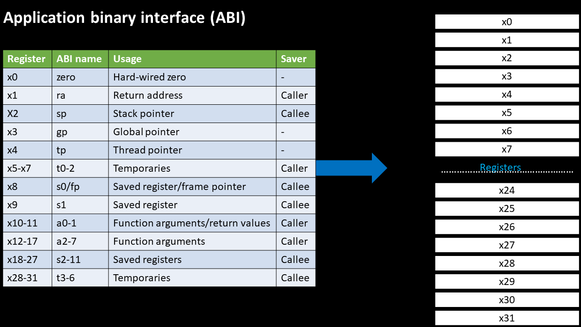

# A MICRO ARCHITECTURE TO IMPLEMENT RV32I Instruction set  

RISC-V is a free and open ISA enabling a new era of processor innovation through open standard collaboration. The RISC-V ISA delivers a new level of free, extensible software and hardware freedom on architecture, paving the way for the next 50 years of computing design and innovation. TL Verilog has been used to implement Microarchitecture. TL Verilog has been very handy, especially when implementing pipelining concepts. Makerchip IDE is the platform which we used to work on TL Verilog. RISCV has 32 registers. For RV32 the width of registers is 32, where as for RV64 it is 64. RISCV is little Endian Addressing system. Instruction size is always 32 bit for RISCV. 

#  Description of Work:
 If a program is written in higher level language [C/C++] , it needs to be converted to binary format in order to execute on hardware. Steps:
1) Compiler takes highlevel C program and generates instructions from it. The format like .exe file comes out. These instruction format may change depending on type of ISA like RISCV/ARM ISA etc. Instructions are abstract interface between C/C++ and hardware, hence they are called ISA. 
2) These instructions are taken by Assembler and it generates binary pattern. Hardware has to understand the function. We need RTL which implements the add/subtract specification.
RISCV  Compiler converts C code into ISA. Spike simulator will help to generate output of the assembly of instructions.

# Spike Simulator:
Spike is the golden reference functional RISC-V ISA C++ sofware simulator. It serves as a starting point for running software on a RISC-V target. Sum of 1st n natural numbers has been taken as an example and all the steps are clearly documented in Day2 folder.

# Application Binary Interface: 
 Some parts of ISA  can be directly accessed by user and OS via system calls. If application programmer wants to access hardware he should do this through the registers. Sum of 1 to n natural numbers coding has been done using the concept of Application Binary Interface. RISCV has 32 registers. For RV32 the width of registers is 32, where as for RV64 it is 64. The data can be loaded from memory to registers or directly sent, Application programmer can access each of these 32 registers through its ABI name. 
 

Sum of 1 to n natural numbers has been implemented using ABI concept. Please go through the Day2 folder documentation for more details. 

#  MAKERCHIP, TL VERILOG & DIGITAL DESIGN: 

Introduction to TL Verilog:

Transaction Level Verilog or TL-Verilog is an extension to existing Verilog HDL and a huge step forward in coding HDL languages. TL-Verilog supports "timing abstraction" or pipelining as a fundamental language construct. Pipelines provide context for sequential logic. TL-V eliminates the need to code sequential elements, such as flip-flops, explicitly. With the below TL-Verilog constructs, half of the content in  Verilog/SystemVerilog books becomes obsolete.

Combinational and Sequential Logic: $signals and expressions

Pipelines: |pipelines and @stages

Validity: ?$valid

Pipeline interactions: >>alignment

Hierarchy: /hierarchy

State: $State

Transaction Flows: $ANY

File Structure: \SV, \SV_plus, \TLV, \TLV_version

# Introduction to Makerchip:
  
   Makerchip is a free online environment by Redwood EDA for developing high-quality integrated circuits. The online platform can be used to code, compile, simulate and debug Verilog designs all in just one tool. What is so special about TL-V is its integration with SandPiper. SandPiper is a code generator which converts code written in TL_Verilog code to a well-structured SystemVerilog code. Below is the code generated for riscv core:
    

# Example of Fibonacci series to analyze the advantage of TL Verilog:

The modelling of D flipflop is that it passes next state value to current state on rising clock edge.

By using the above principle we model circuit diagram of fibonacci series. The circuit diagram of fibonacciseries is shown below:

The TL verilog code has been written as below in makerchip IDE platform. There is no flipflop coding done here. 

   
The sequential and combinational calculator and riscv design has been designed in MakerChip IDE. The codes and screenshots are captured in the Day3-5 folders and also the screenshot documents.

Summary:
The complete implementation of sequential calculator has been done and also the  pipelining has been implemented on it
The complete implementation of riscv has been done and problems of readwrite hazard and branch hazard and load hazard had been addressed.
The codes can be seen in  Day3-5 and Day2 folder

